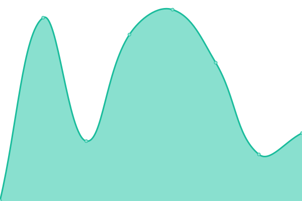
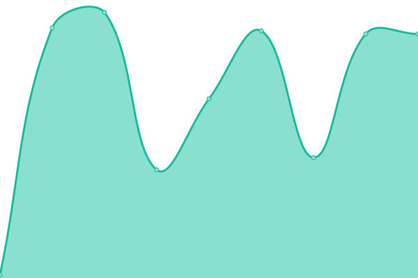

# [📈 Live Status](https://mike-wilt.github.io//upptime): <!--live status--> **🟧 Partial outage**

This repository contains the open-source uptime monitor and status page for [mike-wilt](https://mike-wilt.github.io//upptime), powered by [Upptime](https://github.com/upptime/upptime).

With [Upptime](https://upptime.js.org), you can get your own unlimited and free uptime monitor and status page, powered entirely by a GitHub repository. We use [Issues](https://github.com/mike-wilt//upptime/issues) as incident reports, [Actions](https://github.com/mike-wilt//upptime/actions) as uptime monitors, and [Pages](https://mike-wilt.github.io//upptime) for the status page.

<!--start: status pages-->
<!-- This summary is generated by Upptime (https://github.com/upptime/upptime) -->
<!-- Do not edit this manually, your changes will be overwritten -->
<!-- prettier-ignore -->
| URL | Status | History | Response Time | Uptime |
| --- | ------ | ------- | ------------- | ------ |
|  [affigame](https://www.affigame.com) | 🟩 Up | [affigame.yml](https://github.com/mike-wilt/upptime/commits/HEAD/history/affigame.yml) | 

 392ms
     
 | 

<a href="https://mike-wilt.github.io/upptime/history/affigame">100.00%</a>
    

|  affigame fivepd | 🟥 Down | [affigame-fivepd.yml](https://github.com/mike-wilt/upptime/commits/HEAD/history/affigame-fivepd.yml) | 

 0ms
     
 | 

<a href="https://mike-wilt.github.io/upptime/history/affigame-fivepd">0.00%</a>
    

|  affigame fivem dev | 🟥 Down | [affigame-fivem-dev.yml](https://github.com/mike-wilt/upptime/commits/HEAD/history/affigame-fivem-dev.yml) | 

 0ms
     
 | 

<a href="https://mike-wilt.github.io/upptime/history/affigame-fivem-dev">0.00%</a>
    

|  affigame fivem TEST | 🟥 Down | [affigame-fivem-test.yml](https://github.com/mike-wilt/upptime/commits/HEAD/history/affigame-fivem-test.yml) | 

 0ms
     
 | 

<a href="https://mike-wilt.github.io/upptime/history/affigame-fivem-test">0.00%</a>
    

<!--end: status pages-->

[**Visit our status website →**](https://mike-wilt.github.io//upptime)

## 📄 License

- Powered by: [Upptime](https://github.com/upptime/upptime)
- Code: [MIT](./LICENSE) © [mike-wilt](https://mike-wilt.github.io//upptime)
- Data in the `./history` directory: [Open Database License](https://opendatacommons.org/licenses/odbl/1-0/)
